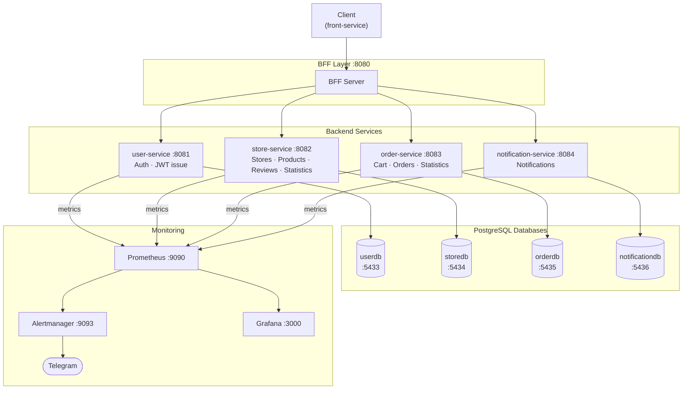
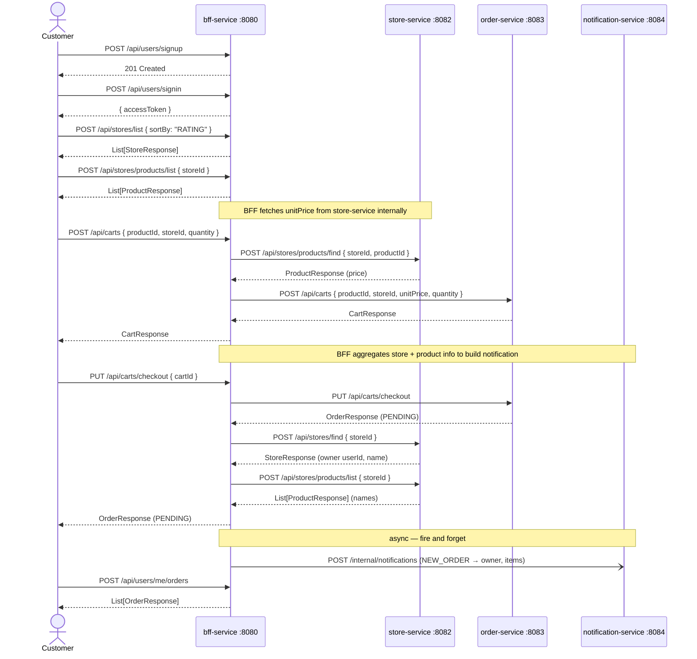
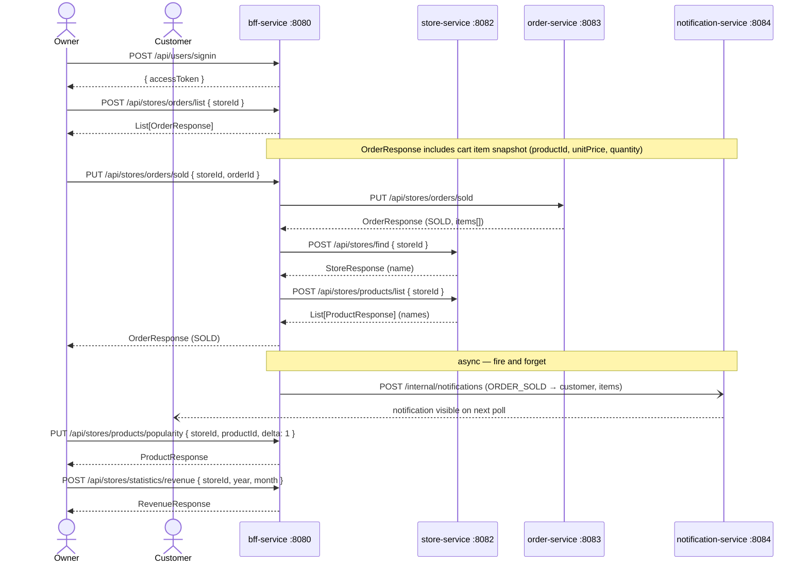
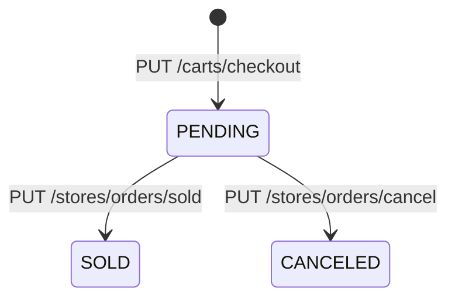
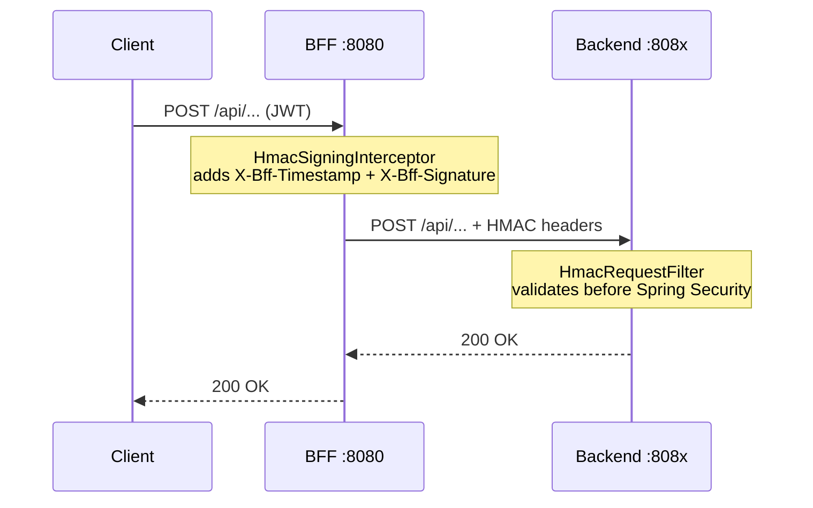
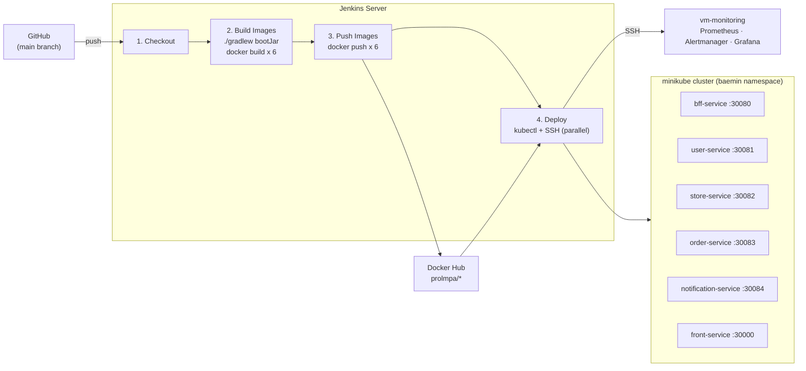

# Baemin — Food Delivery Backend

A microservices backend inspired by Baemin (배달의민족), South Korea's largest food delivery platform.
Built with **Kotlin 2.x + Spring Boot 4** as a hands-on microservices architecture project.

---

## Architecture



All client requests flow through the BFF, which aggregates cross-service calls and forwards them to the appropriate backend service. There are no direct service-to-service calls between backend services. Each service owns its own PostgreSQL database. Foreign-key-like references across services (e.g. `store_id` in `orders`) are plain `BIGINT` columns — no ORM join, no FK constraint across DB boundaries.

The JWT secret is shared across all services via configuration — user-service issues tokens, and store-service and order-service validate them independently using the same secret. No runtime call is made between services for authentication.

Every BFF→backend call is signed with HMAC-SHA256. The BFF attaches `X-Bff-Timestamp` and `X-Bff-Signature` headers to each outgoing `RestClient` request; each backend service validates the signature before Spring Security runs, rejecting direct callers with `401 Unauthorized`. Each service has its own independent HMAC secret.

Notifications are created asynchronously (fire-and-forget) by the BFF after order mutations. After a checkout the BFF looks up the store owner and calls notification-service to notify them; after marking an order sold or canceled it calls notification-service to notify the customer. The BFF calls `/internal/notifications` (no JWT) — notification-service treats the BFF as a trusted internal caller. The notification call runs in a background thread (`CompletableFuture.runAsync`) so failures are silent and do not affect the API response. Clients poll the REST endpoint to fetch and mark notifications.

### BFF Layer

The BFF (Backend for Frontend) sits between the client and the four backend services. Its responsibilities:

- **Routing** — forwards requests to the correct backend service
- **Aggregation** — combines data from multiple services into a single response (e.g. order list enriched with store/product names)
- **Auth delegation** — attaches the JWT from the client and forwards it; each backend service validates independently
- **Cross-service data hand-off** — handles flows where data from one service is needed as input to another (e.g. fetching `unitPrice` from store-service before calling order-service to add a cart item)

---

## Tech Stack

| Layer | Technology |
|---|---|
| Language | Kotlin 2.2 |
| Framework | Spring Boot 4.0 |
| Security | Spring Security 7, JWT (jjwt 0.12) |
| Persistence | Spring Data JPA, Hibernate, QueryDSL 5.1 |
| Database | PostgreSQL 16 |
| Caching | Caffeine (L1, in-process) + Redis (L2, shared) |
| Resilience | Resilience4j 2.3 (circuit breaker) |
| Observability | Spring Boot Actuator, Micrometer, Prometheus, Grafana, Alertmanager |
| Build | Gradle 9 (Kotlin DSL), kapt |
| Java | JDK 24 |
| Testing | JUnit 5, Mockito 5, MockMvc |
| Infrastructure | Docker, Kubernetes (minikube), Jenkins |

---

## API Reference

All read operations use `POST` with a JSON request body. Mutation operations use `POST` (create), `PUT` (update/action), or `DELETE`.

### user-service · `:8081`

| Method | Path | Auth | Body / Notes |
|--------|------|------|--------------|
| `POST` | `/api/users/signup` | Public | `{ email, password, phone?, role? }` → `201 Created` |
| `POST` | `/api/users/signin` | Public | `{ email, password }` → `{ accessToken, tokenType }` |
| `PUT`  | `/api/users/suspend` | ADMIN | `{ id }` — suspend user (sets status `SUSPENDED`) |
| `PUT`  | `/api/users/me/withdraw` | Any | Self-withdraw (sets status `WITHDRAWN`) |

---

### store-service · `:8082`

#### Stores

| Method | Path | Auth | Body / Notes |
|--------|------|------|--------------|
| `POST` | `/api/stores` | OWNER | `{ name, address, phone, content, storePictureUrl?, productCreatedTime, openedTime, closedTime, closedDays }` |
| `POST` | `/api/stores/list` | Any | `{ sortBy: "CREATED_AT"\|"RATING" }` → `List<StoreResponse>` |
| `POST` | `/api/stores/mine` | OWNER | *(no body)* → `List<StoreResponse>` |
| `POST` | `/api/stores/find` | Any | `{ id }` → `StoreResponse` |
| `PUT`  | `/api/stores` | OWNER | `{ id, name, address, phone, ... }` |
| `PUT`  | `/api/stores/deactivate` | OWNER | `{ id }` — soft-delete (sets status `INACTIVE`) |

#### Products

| Method | Path | Auth | Body / Notes |
|--------|------|------|--------------|
| `POST` | `/api/stores/products` | OWNER | `{ storeId, name, description, price, productPictureUrl? }` |
| `POST` | `/api/stores/products/list` | Any | `{ storeId }` → `List<ProductResponse>` |
| `POST` | `/api/stores/products/find` | Any | `{ storeId, productId }` → `ProductResponse` |
| `PUT`  | `/api/stores/products` | OWNER | `{ storeId, productId, name, description, price, productPictureUrl? }` |
| `PUT`  | `/api/stores/products/deactivate` | OWNER | `{ storeId, productId }` |
| `PUT`  | `/api/stores/products/popularity` | OWNER | `{ storeId, productId, delta }` — increment popularity |

#### Reviews

| Method | Path | Auth | Body / Notes |
|--------|------|------|--------------|
| `POST`   | `/api/stores/reviews` | CUSTOMER | `{ storeId, rating, content }` |
| `POST`   | `/api/stores/reviews/list` | Any | `{ storeId }` → `List<ReviewResponse>` |
| `DELETE` | `/api/stores/reviews` | CUSTOMER (own) / ADMIN | `{ storeId, reviewId }` |

#### Statistics

| Method | Path | Auth | Body / Notes |
|--------|------|------|--------------|
| `POST` | `/api/stores/statistics/popular-products` | OWNER | `{ storeId }` → `List<ProductResponse>` ordered by popularity |

---

### order-service · `:8083`

#### Cart

| Method | Path | Auth | Body / Notes |
|--------|------|------|--------------|
| `POST`   | `/api/carts` | CUSTOMER | `{ productId, storeId, quantity }` — BFF fetches `unitPrice`; creates cart if none; resets if different store |
| `POST`   | `/api/carts/me` | CUSTOMER | *(no body)* → current cart |
| `DELETE` | `/api/carts/products` | CUSTOMER | `{ cartId, productId }` — remove one item |
| `DELETE` | `/api/carts` | CUSTOMER | `{ cartId }` — clear all items |
| `PUT`    | `/api/carts/checkout` | CUSTOMER | `{ cartId }` — creates `Order(PENDING)` |

#### Orders

| Method | Path | Auth | Body / Notes |
|--------|------|------|--------------|
| `POST` | `/api/stores/orders/list` | OWNER | `{ storeId }` → `List<OrderResponse>` |
| `PUT`  | `/api/stores/orders/sold` | OWNER | `{ storeId, orderId }` — PENDING → SOLD |
| `PUT`  | `/api/stores/orders/cancel` | OWNER | `{ storeId, orderId }` — PENDING → CANCELED |
| `POST` | `/api/users/me/orders` | CUSTOMER | *(no body)* → `List<OrderResponse>` |

#### Statistics

| Method | Path | Auth | Body / Notes |
|--------|------|------|--------------|
| `POST` | `/api/stores/statistics/revenue` | OWNER | `{ storeId, year, month, timezone? }` → `RevenueResponse` |
| `POST` | `/api/users/me/statistics/spending` | CUSTOMER | `{ year, month, timezone? }` → `SpendingResponse` |

---

### notification-service · `:8084`

#### User Notifications

| Method | Path | Auth | Body / Notes |
|--------|------|------|--------------|
| `POST` | `/api/notifications/list` | Any | `{ unreadOnly: Boolean }` → `List<NotificationResponse>` |
| `PUT`  | `/api/notifications/read` | Any | `{ notificationId }` — mark one notification as read |
| `PUT`  | `/api/notifications/read-all` | Any | *(no body)* — mark all as read |

`/internal/notifications` (no JWT) is called by the BFF to create notifications — it is not exposed to clients.

#### Public Notifications

| Method | Path | Auth | Body / Notes |
|--------|------|------|--------------|
| `POST` | `/api/public-notifications/list` | Public | *(no body)* → `List<PublicNotificationResponse>` — served from two-level cache |
| `POST` | `/api/public-notifications` | ADMIN | `{ title, content, expiresAt }` → `201 Created` |
| `PUT`  | `/api/public-notifications/deactivate` | ADMIN | `{ notificationId }` — soft-deactivate |

---

## API Flow Examples

### New customer places an order



### Owner manages a store order



---

## Key Design Decisions

### All reads use POST + JSON body
Path variables and query params for read operations are moved into the request body. This eliminates resource IDs from URLs on query-only endpoints (e.g. `POST /api/stores/find` with `{ "id": 5 }` instead of `GET /api/stores/5`).

### Multiple carts per user, one active at a time
`carts.user_id` is non-unique. A user accumulates carts over time; only the one with `is_ordered = false` is the active cart (queried via `findByUserIdAndIsOrderedFalse`). Ordered carts are preserved as history, permanently linked to their order. When a customer adds a product from a different store, the active cart is reset in-place — items cleared, `store_id` updated.

### Order status flow



Only `PENDING` orders can transition.

### Popularity tracking
`products.popularity` is a `BIGINT` incremented by the client calling `PUT /api/stores/products/popularity` with `{ storeId, productId, delta }` after marking an order `SOLD`. Queried via QueryDSL (`ORDER BY popularity DESC`) to surface popular items.

### No shared database
Each service has its own PostgreSQL instance. Foreign-key-like references across services (e.g. `store_id` in `orders`) are plain `BIGINT` columns — no ORM join, no FK constraint across DB boundaries.

### Long for all monetary and accumulative fields
`price`, `unit_price`, `total_price`, `popularity`, `quantity`, `total_revenue`, `total_spending` are all `BIGINT` / `Long` to prevent integer overflow on aggregates.

### Statistics via QueryDSL with timezone support
Monthly aggregates compute UTC epoch-millis boundaries from a caller-supplied timezone:
```kotlin
ZonedDateTime.of(year, month, 1, 0, 0, 0, 0, zoneId).toInstant().toEpochMilli()
```

### BFF-triggered fire-and-forget notifications
Notifications are created by the BFF immediately after order mutations — no message broker is involved. Every notification includes a full item snapshot (product name, unit price, quantity) and the store name.

| BFF action | Recipient | Type | Item source |
|---|---|---|---|
| `checkout` | Store owner | `NEW_ORDER` | BFF fetches active cart + product names from store-service |
| `markSold` | Customer | `ORDER_SOLD` | order-service returns cart snapshot in `OrderResponse.items` |
| `markCanceled` | Customer | `ORDER_CANCELED` | order-service returns cart snapshot in `OrderResponse.items` |

**userId security:** `StoreResponse.userId` and `OrderResponse.userId` are annotated `@get:JsonIgnore` / `@param:JsonProperty` — deserialized from backend services, never serialized to the frontend. The recipient's `userId` only ever exists inside the BFF at request time.

**Delivery:** notifications are created in a background thread (`CompletableFuture.runAsync`) after the BFF returns its response to the client. Failures are swallowed silently and do not affect the API caller. The frontend polls `/api/notifications/list` every 30 seconds; recipients see new notifications within one poll cycle assuming the async call succeeds.

### Two-level cache for public notifications (Caffeine + Redis)

`POST /api/public-notifications/list` is called on every page load — including by unauthenticated visitors — making it the highest-frequency read endpoint in the system. To avoid a database hit on every request, notification-service uses a two-level read-through cache with write-through eviction.

**Read path (`listActive`)**

```
Request
  │
  ├─ L1 hit  → Caffeine (in-process, TTL 1 min)  ──────────────────────► return
  │
  ├─ L1 miss → Redis (shared, TTL 10 min) ──► repopulate Caffeine ──────► return
  │
  └─ L2 miss → PostgreSQL ──► write to Redis + Caffeine ─────────────────► return
```

**Write path (create / deactivate)**

Both mutations call `evictCache()` immediately after the DB write, invalidating both layers atomically:

```kotlin
private fun evictCache() {
    stringRedisTemplate.delete(cacheKey)   // evict Redis
    caffeineCache.invalidate(cacheKey)     // evict Caffeine
}
```

The next read after any mutation falls all the way through to the DB and repopulates both layers, ensuring stale data is never served after a change.

**Cache parameters**

| Layer | Implementation | TTL | Scope |
|---|---|---|---|
| L1 | Caffeine (`Cache<String, Any>`) | 1 minute | Per JVM instance |
| L2 | Redis (`StringRedisTemplate`, JSON) | 10 minutes | Shared across all instances |

The Caffeine TTL is intentionally shorter than Redis so that in a multi-instance deployment, stale L1 entries expire quickly while Redis continues to absorb DB traffic.

**Cache key:** `public-notifications:active` — the entire active list is stored as a single JSON array under one key. Invalidation is therefore O(1) regardless of how many notifications exist.

---

### Resilience4j circuit breaker on NotificationClient

All four `NotificationClient` methods are annotated `@CircuitBreaker(name = "notification")`. Configuration (COUNT_BASED): sliding window 10, minimum calls 5, 50% failure threshold, 30 s open wait, 3 permitted calls in half-open, auto-transition enabled.

**Fallback behaviour:** the fire-and-forget `createNotification` logs a warning and returns silently; user-facing methods (`listMyNotifications`, `markRead`, `markAllRead`) return empty results or `Unit` so the API caller is unaffected. The circuit breaker state is exposed via `/actuator/prometheus` and triggers the Alertmanager `CircuitBreakerOpen` alert.

### Monitoring — Prometheus, Grafana, Alertmanager

All five services expose Prometheus metrics at `/actuator/prometheus` (Spring Boot Actuator + Micrometer). A dedicated `vm-monitoring` VM runs all three tools natively as systemd services:

| Service | Package | Port | Role |
|---|---|---|---|
| `prometheus` | `prometheus` (apt) | 9090 | Scrapes `/actuator/prometheus` via minikube NodePorts every 15 s |
| `prometheus-alertmanager` | `prometheus-alertmanager` (apt) | 9093 | Routes firing alerts to Telegram |
| `grafana-server` | `grafana` (Grafana apt repo) | 3000 | Dashboard provisioned from `monitoring/grafana/` |

Alert rule: `CircuitBreakerOpen` — fires immediately when `resilience4j_circuitbreaker_state{state="open"} == 1`, sending a Telegram message via Alertmanager. Config files (`prometheus.yml`, `alertmanager.yml`) are templates with `${VAR}` placeholders substituted by `envsubst` on the Jenkins agent, then SCP'd to `/opt/monitoring/` on vm-monitoring. Jenkins reloads the services via `sudo systemctl reload`; no process restart is required for config-only changes.

### BFF-to-backend HMAC signing

All four `RestClient` beans in the BFF have an `HmacSigningInterceptor` that signs every outgoing request. The signature covers method, path, timestamp, and a SHA-256 hash of the request body:

```
signature = HMAC-SHA256(secret, METHOD + "\n" + PATH + "\n" + TIMESTAMP_MS + "\n" + SHA256(body))
```

The result is sent as two headers: `X-Bff-Timestamp` (epoch milliseconds) and `X-Bff-Signature` (hex). Each backend service runs `HmacRequestFilter` at `HIGHEST_PRECEDENCE` — before Spring Security — and rejects any request that fails the following checks. `/actuator/**` paths are exempt from HMAC validation to allow Prometheus scraping without authentication.

| Check | Response |
|---|---|
| `X-Bff-Timestamp` or `X-Bff-Signature` missing | `401 Missing HMAC headers` |
| Timestamp outside ±30 s of server time | `401 Request expired` |
| Signature mismatch | `401 Invalid HMAC signature` |

Each service has its **own independent secret** (`bff.hmac.secret` in each backend, `bff.hmac.{service}.secret` in the BFF). A leaked secret for one service does not affect the others. In production, secrets are injected via environment variables (`BFF_HMAC_USER_SECRET`, `BFF_HMAC_STORE_SECRET`, etc.).



---

## Database Schema

```mermaid
erDiagram
    %% ── userdb :5433 (user-service) ────────────────────────
    users {
        bigserial id PK
        varchar   email
        varchar   password_hash
        varchar   phone
        varchar   role        "CUSTOMER | OWNER | ADMIN"
        varchar   status      "ACTIVE | SUSPENDED | WITHDRAWN"
        bigint    created_at
        bigint    updated_at
    }

    %% ── storedb :5434 (store-service) ──────────────────────
    stores {
        bigserial id PK
        bigint    user_id              "* cross-service ref — no FK"
        varchar   name
        varchar   address
        varchar   phone
        text      content
        varchar   status               "ACTIVE | INACTIVE"
        varchar   store_picture_url    "nullable"
        bigint    product_created_time
        bigint    opened_time
        bigint    closed_time
        varchar   closed_days
        bigint    created_at
        bigint    updated_at
    }
    products {
        bigserial id PK
        bigint    store_id FK
        varchar   name
        text      description
        bigint    price
        varchar   product_picture_url "nullable"
        bigint    popularity
        boolean   status
        bigint    created_at
        bigint    updated_at
    }
    reviews {
        bigserial id PK
        bigint    store_id FK
        bigint    user_id     "* cross-service ref — no FK"
        int       rating
        text      content
        bigint    created_at
        bigint    updated_at
    }

    %% ── orderdb :5435 (order-service) ──────────────────────
    carts {
        bigserial id PK
        bigint    user_id     "* cross-service ref — no FK, indexed non-unique"
        bigint    store_id    "* cross-service ref — no FK"
        boolean   is_ordered
        bigint    created_at
        bigint    updated_at
    }
    cart_products {
        bigserial id PK
        bigint    cart_id FK
        bigint    product_id  "* cross-service ref — no FK"
        bigint    quantity
        bigint    unit_price
    }
    orders {
        bigserial id PK
        bigint    cart_id FK
        bigint    user_id     "* cross-service ref — no FK"
        bigint    store_id    "* cross-service ref — no FK"
        bigint    total_price
        varchar   status      "PENDING | SOLD | CANCELED"
        bigint    created_at
        bigint    updated_at
    }

    %% ── notificationdb :5436 (notification-service) ────────
    notifications {
        bigserial id PK
        bigint    user_id     "* cross-service ref — no FK, indexed non-unique"
        varchar   type        "NEW_ORDER | ORDER_SOLD | ORDER_CANCELED"
        varchar   title
        text      content
        bigint    store_id    "nullable snapshot — no FK"
        varchar   store_name  "nullable snapshot"
        text      items       "JSON array snapshot"
        boolean   is_read
        bigint    issued_at
        bigint    expiry
        bigint    created_at
    }
    public_notifications {
        bigserial id PK
        varchar   title
        text      content
        boolean   is_active   "indexed — list query filters by this"
        bigint    issued_at
        bigint    expires_at
    }

    %% relationships within storedb
    stores      ||--o{ products      : "has"
    stores      ||--o{ reviews       : "has"

    %% relationships within orderdb
    carts       ||--o{ cart_products : "contains"
    carts       ||--o| orders        : "becomes"
```



---

## CI/CD — Jenkins Pipeline

### Pipeline Overview



### Stages

| Stage | What happens |
|---|---|
| **Checkout** | Pulls `main` branch from GitHub |
| **Build Images** | `./gradlew bootJar -x test` — produces fat JARs; `docker build` for all 6 services (5 Spring + `front-service`); each image tagged with a 12-char git SHA and `latest` |
| **Push Images** | `docker login` with `docker-hub-cred`; pushes both tags for all 6 images to Docker Hub; removes local images immediately after push to prevent disk exhaustion |
| **Deploy** | Two parallel tasks: (1) **k8s** — applies the `baemin` namespace, injects Kubernetes Secrets from Jenkins credentials (never stored in git), applies ConfigMaps/Deployments/Services from `k8s/`, rolls out the new image tag across all 6 Deployments, and waits for each rollout; (2) **vm-monitoring** — `envsubst` substitutes `${MINIKUBE_IP}` and Telegram credentials into config templates, copies via SCP, and recreates Prometheus, Alertmanager, and Grafana containers |

All 6 services run as Kubernetes Deployments in the `baemin` namespace, exposed via NodePort Services. ConfigMaps supply non-sensitive configuration (JDBC URLs pointing to `host.minikube.internal`, Redis host, backend service URLs). Kubernetes Secrets supply credentials — Jenkins creates them at deploy time using `--dry-run=client | kubectl apply -f -` so no secrets appear in the repo. Prometheus scrapes metrics via minikube NodePorts. The monitoring stack deploys identically to before, only the scrape targets change.

### Jenkins Credentials & Global Env Vars

Credentials stored in Jenkins — no values appear in the `Jenkinsfile`:

| Credential ID | Type | Used for |
|---|---|---|
| `github-cred` | Username/password | Checkout from GitHub |
| `docker-hub-cred` | Username/password | `docker login` to Docker Hub |
| `deploy-ssh-key` | SSH private key | `sshagent` for SSH/SCP to vm-monitoring |
| `minikube-kubeconfig` | Secret file | `withKubeConfig` — kubeconfig for the minikube cluster |
| `telegram-bot-token` | Secret text | Alertmanager webhook to Telegram |
| `telegram-chat-id` | Secret text | Alertmanager webhook to Telegram |
| `MINIKUBE_IP` | Secret text | `minikube ip` output — Prometheus NodePort scrape targets |

`MONITORING_HOST`, DB connection strings, JWT secret, and HMAC secrets are stored as Jenkins Global Environment Variables. `MONITORING_HOST` is used for SSH to vm-monitoring; the rest are injected into Kubernetes Secrets at deploy time.

---

## Getting Started

### Prerequisites
- Docker + Docker Compose
- JDK 24

### 1. Start all databases

```bash
docker compose up -d
```

### 2. Apply schemas

```bash
docker compose exec -T user-db         psql -U user_svc  -d userdb         < user-service/src/main/resources/db/schema.sql
docker compose exec -T store-db        psql -U store_svc -d storedb        < store-service/src/main/resources/db/schema.sql
docker compose exec -T order-db        psql -U order_svc -d orderdb        < order-service/src/main/resources/db/schema.sql
docker compose exec -T notification-db psql -U notif_svc -d notificationdb < notification-service/src/main/resources/db/schema.sql
```

### 3. Run services

```bash
# Each in a separate terminal
./gradlew :user-service:bootRun
./gradlew :store-service:bootRun
./gradlew :order-service:bootRun
./gradlew :notification-service:bootRun
./gradlew :bff-service:bootRun
```

### 4. Run tests

```bash
./gradlew test                              # all modules
./gradlew :store-service:test               # single module
./gradlew :notification-service:test
```
