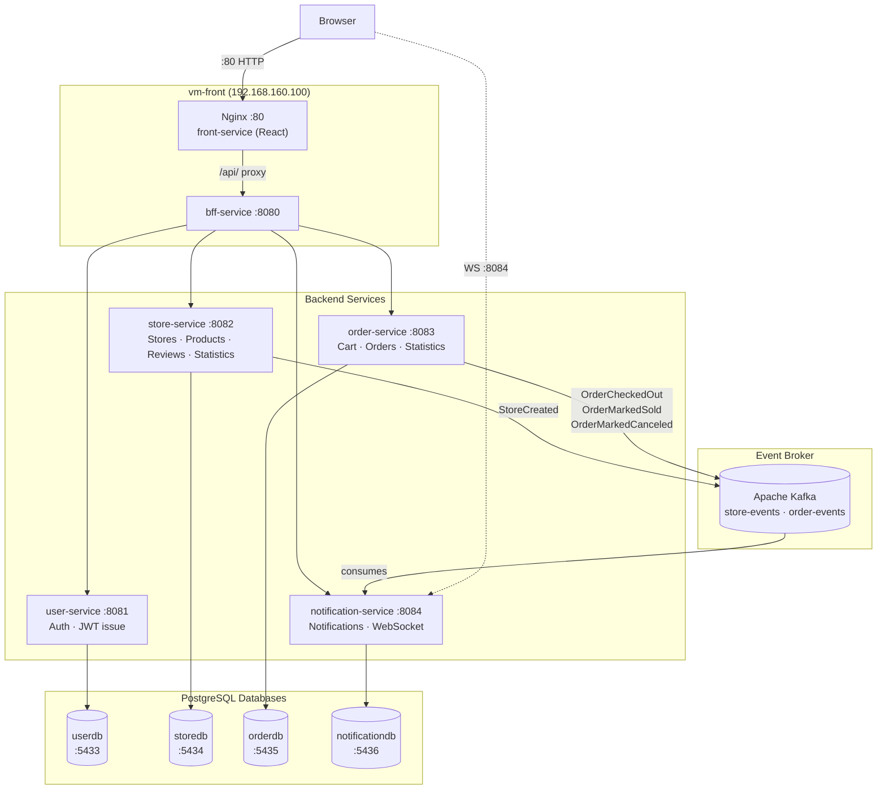
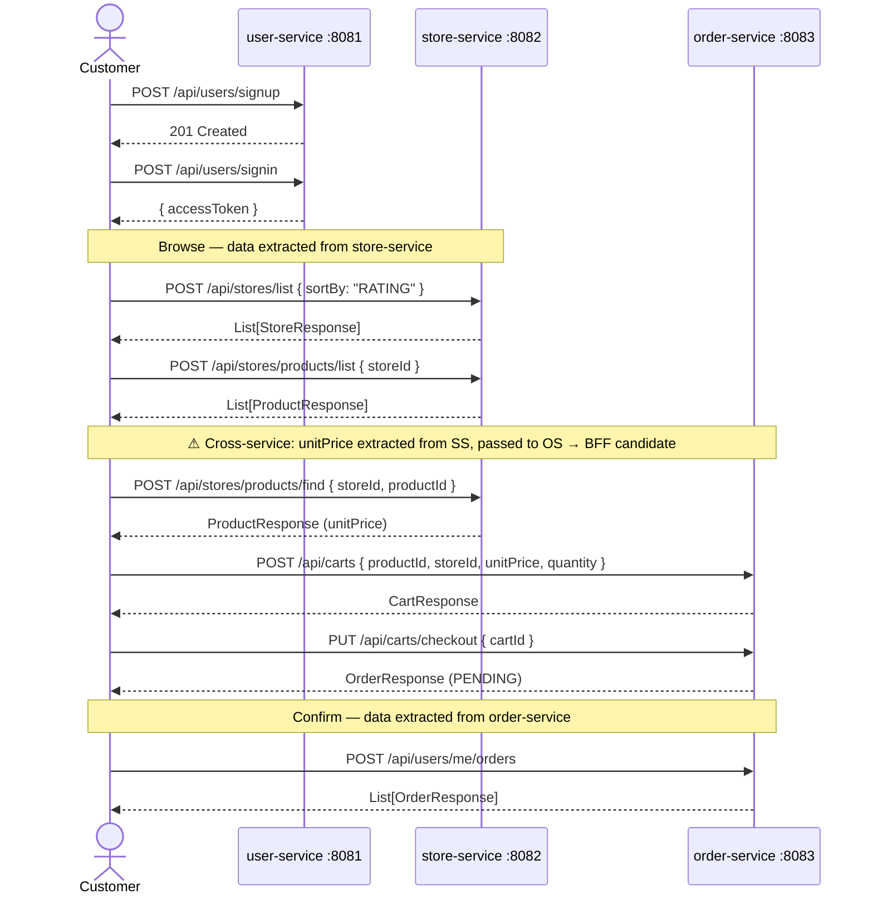
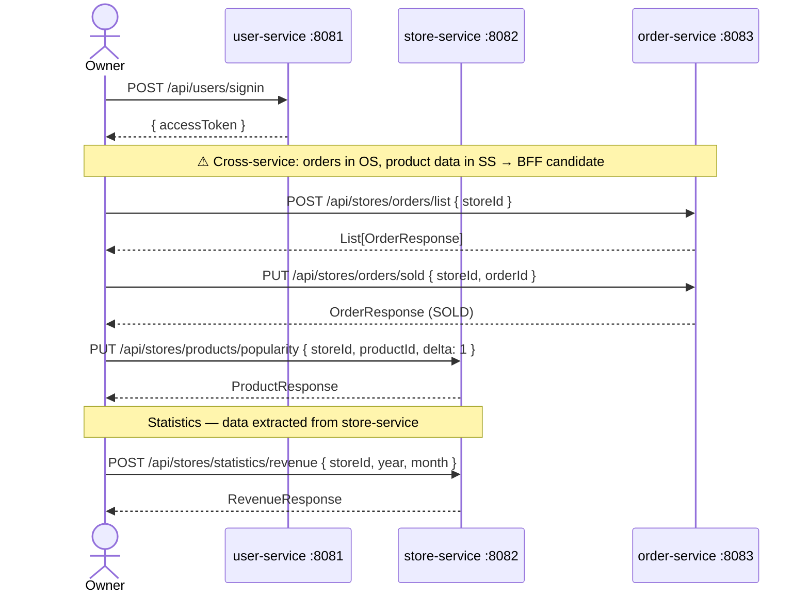
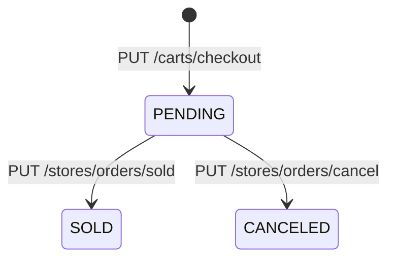

# Baemin — Food Delivery Backend

A microservices backend inspired by Baemin (배달의민족), South Korea's largest food delivery platform.
Built with **Kotlin 2.x + Spring Boot 4** as a hands-on microservices architecture project.

---

## Architecture



The React app (front-service) and bff-service are co-located on the same VM. Nginx on port 80 serves the React SPA and proxies `/api/*` requests to bff-service on port 8080. All API calls flow through the BFF, which aggregates cross-service calls and forwards them to the appropriate backend service. There are no direct service-to-service HTTP calls between backend services. Each service owns its own PostgreSQL database. Foreign-key-like references across services (e.g. `store_id` in `orders`) are plain `BIGINT` columns — no ORM join, no FK constraint across DB boundaries.

The JWT secret is shared across all services via configuration — user-service issues tokens, and store-service and order-service validate them independently using the same secret. No runtime call is made between services for authentication.

Notifications are delivered asynchronously via Apache Kafka. store-service and order-service publish domain events to Kafka topics; notification-service consumes them and persists notifications to its own database. Clients receive real-time pushes via WebSocket and can also poll the REST endpoint.

### BFF Layer

The BFF (Backend for Frontend) sits between the client and the four backend services. Its responsibilities:

- **Routing** — forwards requests to the correct backend service
- **Aggregation** — combines data from multiple services into a single response (e.g. order list enriched with store/product names)
- **Auth delegation** — attaches the JWT from the client and forwards it; each backend service validates independently
- **Cross-service data hand-off** — handles flows where data from one service is needed as input to another (e.g. fetching `unitPrice` from store-service before calling order-service to add a cart item)

---

## Tech Stack

| Layer | Technology |
|---|---|
| Language | Kotlin 2.2 |
| Framework | Spring Boot 4.0 |
| Security | Spring Security 7, JWT (jjwt 0.12) |
| Persistence | Spring Data JPA, Hibernate, QueryDSL 5.1 |
| Database | PostgreSQL 16 |
| Messaging | Apache Kafka, Spring Kafka |
| Build | Gradle 9 (Kotlin DSL), kapt |
| Java | JDK 24 |
| Testing | JUnit 5, Mockito 5, MockMvc |
| Infrastructure | Docker Compose |

---

## API Reference

All read operations use `POST` with a JSON request body. Mutation operations use `POST` (create), `PUT` (update/action), or `DELETE`.

### user-service · `:8081`

| Method | Path | Auth | Body / Notes |
|--------|------|------|--------------|
| `POST` | `/api/users/signup` | Public | `{ email, password, phone?, role? }` → `201 Created` |
| `POST` | `/api/users/signin` | Public | `{ email, password }` → `{ accessToken, tokenType }` |
| `PUT`  | `/api/users/suspend` | ADMIN | `{ id }` — suspend user (sets status `SUSPENDED`) |
| `PUT`  | `/api/users/me/withdraw` | Any | Self-withdraw (sets status `WITHDRAWN`) |

---

### store-service · `:8082`

#### Stores

| Method | Path | Auth | Body / Notes |
|--------|------|------|--------------|
| `POST` | `/api/stores` | OWNER | `{ name, address, phone, content, storePictureUrl?, productCreatedTime, openedTime, closedTime, closedDays }` |
| `POST` | `/api/stores/list` | Any | `{ sortBy: "CREATED_AT"\|"RATING" }` → `List<StoreResponse>` |
| `POST` | `/api/stores/mine` | OWNER | *(no body)* → `List<StoreResponse>` |
| `POST` | `/api/stores/find` | Any | `{ id }` → `StoreResponse` |
| `PUT`  | `/api/stores` | OWNER | `{ id, name, address, phone, ... }` |
| `PUT`  | `/api/stores/deactivate` | OWNER | `{ id }` — soft-delete (sets status `INACTIVE`) |

#### Products

| Method | Path | Auth | Body / Notes |
|--------|------|------|--------------|
| `POST` | `/api/stores/products` | OWNER | `{ storeId, name, description, price, productPictureUrl? }` |
| `POST` | `/api/stores/products/list` | Any | `{ storeId }` → `List<ProductResponse>` |
| `POST` | `/api/stores/products/find` | Any | `{ storeId, productId }` → `ProductResponse` |
| `PUT`  | `/api/stores/products` | OWNER | `{ storeId, productId, name, description, price, productPictureUrl? }` |
| `PUT`  | `/api/stores/products/deactivate` | OWNER | `{ storeId, productId }` |
| `PUT`  | `/api/stores/products/popularity` | OWNER | `{ storeId, productId, delta }` — increment popularity |

#### Reviews

| Method | Path | Auth | Body / Notes |
|--------|------|------|--------------|
| `POST`   | `/api/stores/reviews` | CUSTOMER | `{ storeId, rating, content }` |
| `POST`   | `/api/stores/reviews/list` | Any | `{ storeId }` → `List<ReviewResponse>` |
| `DELETE` | `/api/stores/reviews` | CUSTOMER (own) / ADMIN | `{ storeId, reviewId }` |

#### Statistics

| Method | Path | Auth | Body / Notes |
|--------|------|------|--------------|
| `POST` | `/api/stores/statistics/popular-products` | OWNER | `{ storeId }` → `List<ProductResponse>` ordered by popularity |

---

### order-service · `:8083`

#### Cart

| Method | Path | Auth | Body / Notes |
|--------|------|------|--------------|
| `POST`   | `/api/carts` | CUSTOMER | `{ productId, storeId, unitPrice, quantity }` — creates cart if none; resets if different store |
| `POST`   | `/api/carts/me` | CUSTOMER | *(no body)* → current cart |
| `DELETE` | `/api/carts/products` | CUSTOMER | `{ cartId, productId }` — remove one item |
| `DELETE` | `/api/carts` | CUSTOMER | `{ cartId }` — clear all items |
| `PUT`    | `/api/carts/checkout` | CUSTOMER | `{ cartId }` — creates `Order(PENDING)` |

#### Orders

| Method | Path | Auth | Body / Notes |
|--------|------|------|--------------|
| `POST` | `/api/stores/orders/list` | OWNER | `{ storeId }` → `List<OrderResponse>` |
| `PUT`  | `/api/stores/orders/sold` | OWNER | `{ storeId, orderId }` — PENDING → SOLD |
| `PUT`  | `/api/stores/orders/cancel` | OWNER | `{ storeId, orderId }` — PENDING → CANCELED |
| `POST` | `/api/users/me/orders` | CUSTOMER | *(no body)* → `List<OrderResponse>` |

#### Statistics

| Method | Path | Auth | Body / Notes |
|--------|------|------|--------------|
| `POST` | `/api/stores/statistics/revenue` | OWNER | `{ storeId, year, month, timezone? }` → `RevenueResponse` |
| `POST` | `/api/users/me/statistics/spending` | CUSTOMER | `{ year, month, timezone? }` → `SpendingResponse` |

---

### notification-service · `:8084`

| Method | Path | Auth | Body / Notes |
|--------|------|------|--------------|
| `POST` | `/api/notifications/me` | Any | *(no body)* → `List<NotificationResponse>` |
| `PUT`  | `/api/notifications/read` | Any | `{ notificationId }` — mark one notification as read |
| `WS`   | `/ws/notifications?token=` | Any | Real-time push; authenticate via `token` query param |

Notifications are created internally by Kafka consumers — there is no public creation endpoint.

---

## API Flow Examples

### New customer places an order



### Owner manages a store order



---

## Key Design Decisions

### All reads use POST + JSON body
Path variables and query params for read operations are moved into the request body. This eliminates resource IDs from URLs on query-only endpoints (e.g. `POST /api/stores/find` with `{ "id": 5 }` instead of `GET /api/stores/5`).

### Multiple carts per user, one active at a time
`carts.user_id` is non-unique. A user accumulates carts over time; only the one with `is_ordered = false` is the active cart (queried via `findByUserIdAndIsOrderedFalse`). Ordered carts are preserved as history, permanently linked to their order. When a customer adds a product from a different store, the active cart is reset in-place — items cleared, `store_id` updated.

### Order status flow



Only `PENDING` orders can transition.

### Popularity tracking
`products.popularity` is a `BIGINT` incremented by the client calling `PUT /api/stores/products/popularity` with `{ storeId, productId, delta }` after marking an order `SOLD`. Queried via QueryDSL (`ORDER BY popularity DESC`) to surface popular items.

### No shared database
Each service has its own PostgreSQL instance. Foreign-key-like references across services (e.g. `store_id` in `orders`) are plain `BIGINT` columns — no ORM join, no FK constraint across DB boundaries.

### Long for all monetary and accumulative fields
`price`, `unit_price`, `total_price`, `popularity`, `quantity`, `total_revenue`, `total_spending` are all `BIGINT` / `Long` to prevent integer overflow on aggregates.

### Statistics via QueryDSL with timezone support
Monthly aggregates compute UTC epoch-millis boundaries from a caller-supplied timezone:
```kotlin
ZonedDateTime.of(year, month, 1, 0, 0, 0, 0, zoneId).toInstant().toEpochMilli()
```

### Event-driven notifications via Kafka
Notifications are decoupled from the request path entirely. store-service and order-service publish domain events to Kafka topics; notification-service consumes them asynchronously.

- `userId` never appears in any HTTP request or response body — it travels only inside Kafka event payloads on the internal broker network.
- notification-service maintains a local `store_owner_projections` table (`storeId → ownerUserId`) built from `StoreCreated` events, so it can resolve the store owner without calling store-service at runtime.
- Delivery guarantee: Kafka retains messages (default 7-day retention). If notification-service is down, it replays missed events on recovery.

| Event | Publisher | Topic | Payload |
|---|---|---|---|
| `StoreCreated` | store-service | `store-events` | `{ storeId, ownerUserId }` |
| `OrderCheckedOut` | order-service | `order-events` | `{ orderId, storeId }` |
| `OrderMarkedSold` | order-service | `order-events` | `{ orderId, customerId }` |
| `OrderMarkedCanceled` | order-service | `order-events` | `{ orderId, customerId }` |

---

## Database Schema

```mermaid
erDiagram
    %% ── userdb :5433 (user-service) ────────────────────────
    users {
        bigserial id PK
        varchar   email
        varchar   password
        varchar   phone
        varchar   role        "CUSTOMER | OWNER | ADMIN"
        varchar   status      "ACTIVE | SUSPENDED | WITHDRAWN"
        bigint    created_at
        bigint    updated_at
    }

    %% ── storedb :5434 (store-service) ──────────────────────
    stores {
        bigserial id PK
        bigint    user_id     "* cross-service ref — no FK"
        varchar   name
        varchar   address
        varchar   status      "ACTIVE | INACTIVE"
        bigint    created_at
        bigint    updated_at
    }
    products {
        bigserial id PK
        bigint    store_id FK
        varchar   name
        text      description
        bigint    price
        bigint    popularity
        boolean   status
        bigint    created_at
        bigint    updated_at
    }
    reviews {
        bigserial id PK
        bigint    store_id FK
        bigint    user_id     "* cross-service ref — no FK"
        int       rating
        text      content
        bigint    created_at
        bigint    updated_at
    }

    %% ── orderdb :5435 (order-service) ──────────────────────
    carts {
        bigserial id PK
        bigint    user_id     "* cross-service ref — no FK, indexed non-unique"
        bigint    store_id    "* cross-service ref — no FK"
        boolean   is_ordered
        bigint    created_at
        bigint    updated_at
    }
    cart_products {
        bigserial id PK
        bigint    cart_id FK
        bigint    product_id  "* cross-service ref — no FK"
        bigint    quantity
        bigint    unit_price
    }
    orders {
        bigserial id PK
        bigint    cart_id FK
        bigint    user_id     "* cross-service ref — no FK"
        bigint    store_id    "* cross-service ref — no FK"
        bigint    total_price
        varchar   status      "PENDING | SOLD | CANCELED"
        bigint    created_at
        bigint    updated_at
    }

    %% ── notificationdb :5436 (notification-service) ────────
    notifications {
        bigserial id PK
        bigint    user_id     "* cross-service ref — no FK, indexed non-unique"
        varchar   title
        text      content
        boolean   is_read
        bigint    created_at
    }
    store_owner_projections {
        bigint    store_id PK "projection: storeId → ownerUserId"
        bigint    owner_user_id
    }

    %% relationships within storedb
    stores      ||--o{ products      : "has"
    stores      ||--o{ reviews       : "has"

    %% relationships within orderdb
    carts       ||--o{ cart_products : "contains"
    carts       ||--o| orders        : "becomes"
```



---

## Getting Started

### Prerequisites
- Docker + Docker Compose
- JDK 24

### 1. Start all infrastructure

```bash
docker compose up -d   # starts 4 PostgreSQL instances + Kafka
```

### 2. Apply schemas

```bash
docker compose exec -T user-db         psql -U user_svc   -d userdb         < user-service/src/main/resources/db/schema.sql
docker compose exec -T store-db        psql -U store_svc  -d storedb        < store-service/src/main/resources/db/schema.sql
docker compose exec -T order-db        psql -U order_svc  -d orderdb        < order-service/src/main/resources/db/schema.sql
docker compose exec -T notification-db psql -U notif_svc  -d notificationdb < notification-service/src/main/resources/db/schema.sql
```

### 3. Run services

```bash
# Each in a separate terminal
./gradlew :user-service:bootRun
./gradlew :store-service:bootRun
./gradlew :order-service:bootRun
./gradlew :notification-service:bootRun
```

### 4. Run tests

```bash
./gradlew test                              # all modules
./gradlew :store-service:test               # single module
./gradlew :notification-service:test
```
